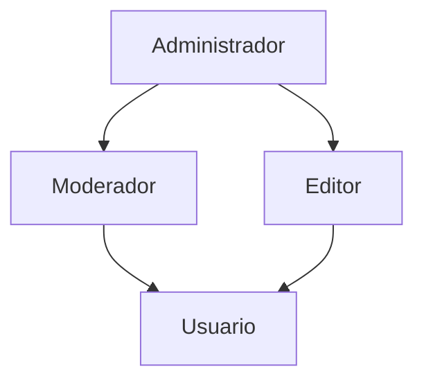

# ❓ FAQ — RBAC ANPD: Perguntas Frequentes

Nota: veja também `docs/README.md` para a consolidação das features DONE/TODO e prioridades por pacote.

[]()
[]()

## 📋 Índice de Perguntas

- [🚀 Introdução e Conceitos](#-introdução-e-conceitos)
- [🔧 Instalação e Configuração](#-instalação-e-configuração)
- [💡 Uso Prático](#-uso-prático)
- [🏗️ Arquitetura e Design](#️-arquitetura-e-design)
- [🔍 Troubleshooting](#-troubleshooting)
- [🚀 Performance e Otimização](#-performance-e-otimização)
- [🔐 Segurança](#-segurança)
- [🔄 Migração e Integração](#-migração-e-integração)

---

## 🚀 Introdução e Conceitos

### ❓ **O que é o RBAC ANPD e por que foi criado?**

O RBAC ANPD é um sistema modular de **Role-Based Access Control** (controle de acesso baseado em papéis) desenvolvido pela Divisão de Desenvolvimento e Sustentação de Sistemas (DDSS/CGTI/ANPD).

**Por que foi criado:**

- 🎯 **Unificação**: Padronizar o modelo de permissões `{acao, recurso}` em todos os sistemas da ANPD
- 🔄 **Reutilização**: Evitar reimplementação de lógica de autorização em cada projeto
- 🔒 **Consistência**: Eliminar divergências entre autorizações de UI e servidor
- 📈 **Escalabilidade**: Suportar hierarquias complexas de perfis e alta concorrência

### ❓ **Qual a diferença entre `Action` e `Resource`?**

```typescript
// Action: O que o usuário quer fazer
type Action = "Criar" | "Exibir" | "Editar" | "Excluir" | "Administrar"

// Resource: Em que entidade/contexto
type Resource = "Usuario" | "Processo" | "Relatorio" | "Dashboard"

// Permissão completa
const permissao = { acao: "Editar", recurso: "Usuario" }
```

**Exemplos práticos:**

- `{ acao: "Exibir", recurso: "Dashboard" }` → Pode ver o dashboard
- `{ acao: "Criar", recurso: "Processo" }` → Pode criar novos processos
- `{ acao: "Administrar", recurso: "Usuarios" }` → Pode gerenciar usuários (super permissão)

### ❓ **Como funciona a hierarquia de perfis?**

O sistema suporta **hierarquias DAG** (Directed Acyclic Graph):



**Regras de herança:**

- ✅ **União por Grant**: `true` sempre prevalece sobre `false`
- ✅ **BFS Traversal**: Busca em largura para resolver hierarquia
- ✅ **Cycle Prevention**: Prevenção automática de loops infinitos
- ✅ **Active Only**: Apenas perfis ativos são considerados

---

## 🔧 Instalação e Configuração

### ❓ **Como instalo apenas o que preciso?**

O sistema é **modular**. Instale apenas os packages necessários:

```bash
# Apenas tipos básicos (0 dependências)
npm install @anpdgovbr/rbac-core

# + Provider abstraction
npm install @anpdgovbr/rbac-provider

# + Prisma ORM integration
npm install @anpdgovbr/rbac-prisma

# + Next.js middleware
npm install @anpdgovbr/rbac-next

# + React hooks/components (React 19+ required)
npm install @anpdgovbr/rbac-react

# + Admin interface (WIP)
npm install @anpdgovbr/rbac-admin
```

### ❓ **Preciso usar Prisma obrigatoriamente?**

**Não!** O Prisma é apenas um dos providers disponíveis:

```typescript
// Provider Prisma (recomendado)
import { createPrismaPermissionsProvider } from "@anpdgovbr/rbac-prisma"

// Provider customizado
class CustomProvider implements PermissionsProvider {
  async getUserPermissions(identity: string): Promise<PermissionsMap> {
    // Sua lógica aqui (Redis, MongoDB, API externa, etc.)
    return permissionsMap
  }
}

// Provider in-memory (desenvolvimento/testes)
const testProvider = {
  async getUserPermissions() {
    return { "Exibir:Dashboard": true, "Criar:Usuario": false }
  },
}
```

### ❓ **Como configuro o cache TTL?**

```typescript
import { withTTLCache } from "@anpdgovbr/rbac-provider"

// Cache básico (1 minuto)
const cachedProvider = withTTLCache(prismaProvider, 60_000)

// Cache avançado com métricas
const advancedCache = withTTLCache(
  prismaProvider,
  300_000, // 5 minutos
  {
    metrics: {
      onHit: (identity) => console.log(`Cache hit: ${identity}`),
      onMiss: (identity) => console.log(`Cache miss: ${identity}`),
    },
    maxSize: 1000,
    invalidateOn: ["role-updated", "permission-changed"],
  }
)

// Invalidação manual
await cachedProvider.invalidate("user@example.com")
await cachedProvider.invalidateAll()
```

---

## 💡 Uso Prático

### ❓ **Como protejo uma rota de API no Next.js?**

```typescript
// app/api/users/route.ts
import { withApi } from "@anpdgovbr/rbac-next"
import { NextResponse } from "next/server"

export const GET = withApi(
  async (context) => {
    // context.userId, context.audit disponíveis
    const users = await getUsers()
    return NextResponse.json(users)
  },
  {
    provider: cachedPrismaProvider,
    getIdentity: nextAuthResolver,
    permissao: { acao: "Exibir", recurso: "Usuarios" },
    audit: auditLogger, // opcional
  }
)
```

### ❓ **Como uso no React com hooks?**

```typescript
import { usePode, usePermissions } from '@anpdgovbr/rbac-react'

function UserDashboard() {
  const { pode, loading } = usePode()
  const { permissions } = usePermissions()

  if (loading) return <Skeleton />

  return (
    <div>
      {pode("Exibir", "Relatorios") && <RelatariosSection />}
      {pode("Criar", "Usuario") && <CreateUserButton />}
      {pode("Administrar", "Sistema") && <AdminPanel />}
    </div>
  )
}
```

### ❓ **Como protejo um componente inteiro?**

```typescript
import { withPermissao } from '@anpdgovbr/rbac-react'

// Componente protegido
const AdminPanel = () => <div>Painel Admin Sensível</div>

// Proteção declarativa
const ProtectedAdminPanel = withPermissao(
  AdminPanel,
  "Acessar",
  "PainelAdmin",
  {
    fallback: <AccessDenied />,
    loading: <LoadingSpinner />
  }
)
```

### ❓ **Como verifico múltiplas permissões (OR lógico)?**

```typescript
import { hasAny } from '@anpdgovbr/rbac-core'

// Qualquer uma das permissões é suficiente
const canAccessDashboard = hasAny(userPermissions, [
  { acao: "Exibir", recurso: "Dashboard" },
  { acao: "Acessar", recurso: "PainelAdmin" },
  { acao: "Visualizar", recurso: "Metricas" }
])

// React Hook version
function Dashboard() {
  const { permissions } = usePermissions()

  const canAccess = hasAny(permissions, [
    { acao: "Exibir", recurso: "Dashboard" },
    { acao: "Administrar", recurso: "Sistema" }
  ])

  if (!canAccess) return <AccessDenied />
  return <DashboardContent />
}
```

---

## 🏗️ Arquitetura e Design

### ❓ **Por que usar monorepo em vez de um package único?**

**Vantagens do monorepo:**

- 🎯 **Modularidade**: Use apenas o que precisa
- 🚀 **Zero Dependencies**: Core package não tem dependências
- 🔄 **Evolução Coordenada**: Mudanças síncronas entre packages
- 📦 **Publicação Independente**: Cada package tem seu ciclo de vida
- 🧪 **Testing**: Testes isolados por responsabilidade

```typescript
// Projeto simples: apenas core
import { pode } from "@anpdgovbr/rbac-core"

// Projeto React: core + react
import { usePode } from "@anpdgovbr/rbac-react"

// Projeto Next.js full: core + provider + prisma + next + react
import { withApi } from "@anpdgovbr/rbac-next"
```

### ❓ **Como o sistema evita acoplamento com frameworks?**

**Inversão de Dependência:**

```typescript
// Core é agnóstico de framework
type Action = string  // Não depende de enums específicos
type Resource = string

// Adapters injetam dependências
interface PermissionsProvider {
  getUserPermissions(identity: string): Promise<PermissionsMap>
}

interface IdentityResolver<TRequest = unknown> {
  getIdentity(req: TRequest): Promise<string | null>
}

// Frameworks são adapters opcionais
const nextAuthResolver: IdentityResolver<NextRequest> = { ... }
const customJWTResolver: IdentityResolver<Request> = { ... }
```

### ❓ **Como contribuir com um novo framework adapter?**

1. **Implemente os contratos base**:

```typescript
// packages/rbac-express/src/index.ts
import { PermissionsProvider, IdentityResolver } from "@anpdgovbr/rbac-provider"
import { Request, Response } from "express"

export const withExpressAuth = (
  handler: (req: Request, res: Response) => void,
  config: {
    provider: PermissionsProvider
    getIdentity: IdentityResolver<Request>
    permissao: Permissao
  }
) => {
  return async (req: Request, res: Response) => {
    // Implementação específica do Express
  }
}
```

2. **Siga o padrão de packages existentes**
3. **Adicione testes e documentação**
4. **Abra PR no monorepo**

---

## 🔍 Troubleshooting

### ❓ **"Permission denied" mesmo com perfil correto**

**Possíveis causas:**

1. **Cache TTL desatualizado**:

```typescript
// Force cache refresh
await cachedProvider.invalidate(userEmail)
```

2. **Perfil inativo na hierarquia**:

```sql
-- Verifique se todos os perfis da cadeia estão ativos
SELECT p.nome, p.ativo, ph.perfil_pai_id
FROM Perfil p
LEFT JOIN PerfilHierarquia ph ON p.id = ph.perfil_filho_id
WHERE p.id IN (/* IDs dos perfis do usuário */)
```

3. **Grant falso sobrescrevendo verdadeiro**:

```typescript
// Debug permissões
import { debugPermissions } from "@anpdgovbr/rbac-core"
debugPermissions(userPermissions, { showDenied: true })
```

4. **Identity resolver retornando null**:

```typescript
const identity = await getIdentity(req)
console.log("Resolved identity:", identity) // Deve retornar email/ID válido
```

### ❓ **Performance lenta nas verificações de permissão**

**Soluções de otimização:**

1. **Ative cache TTL**:

```typescript
const cachedProvider = withTTLCache(provider, 300_000) // 5 min
```

2. **Otimize queries Prisma**:

```typescript
// Use includes seletivos
const provider = createPrismaPermissionsProvider({
  prisma,
  queryOptimization: {
    includeRoleHierarchy: true,
    batchSize: 50,
    useIndexes: ["usuario_email_idx", "perfil_ativo_idx"],
  },
})
```

3. **Monitore performance**:

```typescript
const monitoredProvider = withMetrics(cachedProvider, {
  onPermissionCheck: (identity, action, resource, result, duration) => {
    if (duration > 100) {
      console.warn(`Slow permission check: ${duration}ms`)
    }
  },
})
```

### ❓ **Erro "Cannot read property of undefined" no React**

**Causa comum**: Provider não configurado corretamente.

```typescript
// ❌ Incorreto: hook usado fora do provider
function App() {
  const { pode } = usePode() // Erro!
  return <div>...</div>
}

// ✅ Correto: Provider wrapper
function App() {
  return (
    <PermissionsProvider fetcher={fetchPermissions}>
      <Dashboard /> {/* Hooks funcionam aqui */}
    </PermissionsProvider>
  )
}
```

### ❓ **TypeScript reclama de tipos incompatíveis**

**Solução**: Atualize para versões compatíveis:

```json
{
  "dependencies": {
    "@anpdgovbr/rbac-react": "^0.2.0-beta.1",
    "react": "^19.0.0",
    "typescript": "^5.9.0"
  }
}
```

---

## 🚀 Performance e Otimização

### ❓ **Qual o melhor TTL para cache de permissões?**

**Recomendações por contexto:**

```typescript
// Desenvolvimento: cache curto para mudanças frequentes
const devCache = withTTLCache(provider, 30_000) // 30 segundos

// Produção: balance entre performance e consistência
const prodCache = withTTLCache(provider, 300_000) // 5 minutos

// Alta concorrência: cache longo com invalidação manual
const highConcurrencyCache = withTTLCache(
  provider,
  900_000, // 15 minutos
  {
    invalidateOn: ["user-role-changed", "role-permission-updated"],
  }
)
```

### ❓ **Como otimizar para muitos usuários simultâneos?**

1. **Cache em múltiplas camadas**:

```typescript
// Redis cache + in-memory cache
const redisProvider = createRedisPermissionsProvider({
  redis: redisClient,
  fallback: prismaProvider,
  ttl: 3600, // 1 hora
})

const memoryCache = withTTLCache(redisProvider, 300_000) // 5 min
```

2. **Batch queries no Prisma**:

```typescript
const batchProvider = createPrismaPermissionsProvider({
  prisma,
  batching: {
    enabled: true,
    maxBatchSize: 100,
    batchInterval: 50, // ms
  },
})
```

3. **Preload comum permissions**:

```typescript
// Precarrega permissões mais comuns
await Promise.all(
  ["Exibir:Dashboard", "Criar:Usuario", "Exibir:Relatorios"].map((key) =>
    cachedProvider.preload(key)
  )
)
```

### ❓ **Como medir performance do sistema RBAC?**

```typescript
import { withMetrics } from "@anpdgovbr/rbac-provider"

const metricsProvider = withMetrics(cachedProvider, {
  onPermissionCheck: (identity, action, resource, result, duration) => {
    // Métricas customizadas
    metrics.histogram("rbac.check.duration", duration, {
      action,
      resource,
      result: result.toString(),
    })

    metrics.increment("rbac.checks.total")

    if (duration > 100) {
      metrics.increment("rbac.checks.slow")
    }
  },

  onCacheHit: (identity) => {
    metrics.increment("rbac.cache.hits")
  },

  onCacheMiss: (identity) => {
    metrics.increment("rbac.cache.misses")
  },
})

// Dashboard de métricas
// - Latência P95 das verificações
// - Cache hit ratio
// - Queries mais lentas
// - Permissões mais verificadas
```

---

## 🔐 Segurança

### ❓ **O cache de permissões é seguro?**

**Sim, com as devidas precauções:**

1. **Isolamento por usuário**: Cada identity tem cache separado
2. **TTL configurável**: Reduz janela de inconsistência
3. **Invalidação manual**: Mudanças administrativas invalidam cache
4. **No sensitive data**: Apenas boolean grants são cacheados

```typescript
// Cache seguro com invalidação automática
const secureCache = withTTLCache(
  provider,
  300_000, // 5 min máximo
  {
    // Invalidação em mudanças críticas
    invalidateOn: ["user-deactivated", "role-permissions-changed", "hierarchy-updated"],

    // Métricas de segurança
    onInvalidation: (reason, identity) => {
      auditLogger.log({
        type: "permission-cache-invalidated",
        identity,
        reason,
        timestamp: new Date(),
      })
    },
  }
)
```

### ❓ **Como proteger contra ataques de escalação de privilégios?**

1. **Validação server-side obrigatória**:

```typescript
// ❌ NUNCA confie apenas no client
if (userCanEdit) {
  // Vindo do React
  await updateUser(data) // PERIGOSO!
}

// ✅ SEMPRE valide no servidor
export const PUT = withApi(
  async (context) => {
    // Verificação automática pelo middleware
    return await updateUser(data)
  },
  {
    permissao: { acao: "Editar", recurso: "Usuario" },
  }
)
```

2. **Auditoria completa**:

```typescript
const auditLogger = async (auditData) => {
  await auditService.record({
    userId: auditData.userId,
    action: auditData.action,
    resource: auditData.resource,
    allowed: auditData.allowed,
    timestamp: auditData.timestamp,
    ip: auditData.clientIp,
    userAgent: auditData.userAgent,

    // Contexto adicional para investigação
    sessionId: auditData.sessionId,
    correlationId: auditData.correlationId,
  })
}
```

3. **Princípio do menor privilégio**:

```typescript
// ✅ Permissões específicas
{ acao: "Editar", recurso: "UsuarioPropriosDados" }

// ❌ Permissões muito amplas
{ acao: "Administrar", recurso: "*" }
```

### ❓ **Como implementar rate limiting por permissão?**

```typescript
import { withRateLimit } from "@anpdgovbr/rbac-provider"

const rateLimitedProvider = withRateLimit(cachedProvider, {
  // Limites por ação
  limits: {
    "Criar:Usuario": { requests: 10, window: 60_000 }, // 10/min
    "Excluir:*": { requests: 5, window: 300_000 }, // 5/5min
    "*": { requests: 1000, window: 60_000 }, // default
  },

  // Ação quando limite excedido
  onLimitExceeded: (identity, action, resource) => {
    auditLogger.log({
      type: "rate-limit-exceeded",
      identity,
      action,
      resource,
    })

    throw new TooManyRequestsError()
  },
})
```

---

## 🔄 Migração e Integração

### ❓ **Como migrar de um sistema legado gradualmente?**

**Estratégia híbrida:**

```typescript
// 1. Wrapper de compatibilidade
class LegacyCompatProvider implements PermissionsProvider {
  constructor(
    private legacyAuth: LegacyAuthSystem,
    private newProvider: PermissionsProvider
  ) {}

  async getUserPermissions(identity: string): Promise<PermissionsMap> {
    // Feature flag para migração gradual
    if (await this.shouldUseLegacy(identity)) {
      return this.mapLegacyPermissions(await this.legacyAuth.getUserRoles(identity))
    }

    return this.newProvider.getUserPermissions(identity)
  }

  private mapLegacyPermissions(legacyRoles: string[]): PermissionsMap {
    const mapping: Record<string, Permissao[]> = {
      ADMIN: [{ acao: "Administrar", recurso: "*" }],
      USER: [{ acao: "Exibir", recurso: "Dashboard" }],
      EDITOR: [
        { acao: "Criar", recurso: "Conteudo" },
        { acao: "Editar", recurso: "Conteudo" },
      ],
    }

    const permissions: Permissao[] = []
    legacyRoles.forEach((role) => {
      permissions.push(...(mapping[role] || []))
    })

    return toPermissionsMap(permissions)
  }
}

// 2. Uso no sistema
const hybridProvider = new LegacyCompatProvider(legacyAuthSystem, newPrismaProvider)
```

### ❓ **Como integrar com NextAuth.js?**

```typescript
// 1. Identity resolver NextAuth
import { getServerSession } from 'next-auth'
import { authOptions } from '@/lib/auth'

const nextAuthResolver: IdentityResolver<NextRequest> = {
  async getIdentity(req) {
    const session = await getServerSession(authOptions)
    return session?.user?.email || null
  }
}

// 2. Middleware integration
export const GET = withApi(
  async (context) => {
    // context.userId será o email do NextAuth
    return NextResponse.json({ user: context.userId })
  },
  {
    provider: cachedProvider,
    getIdentity: nextAuthResolver,
    permissao: { acao: "Exibir", recurso: "PerfilUsuario" }
  }
)

// 3. Client-side integration
function App() {
  return (
    <SessionProvider session={session}>
      <PermissionsProvider
        fetcher={async () => {
          const res = await fetch('/api/me/permissions')
          return res.json()
        }}
      >
        <YourApp />
      </PermissionsProvider>
    </SessionProvider>
  )
}
```

### ❓ **Como suportar multi-tenant?**

```typescript
// 1. Tenant-aware provider
const createTenantProvider = (basePrismaProvider: PermissionsProvider) => {
  return {
    async getUserPermissions(identity: string): Promise<PermissionsMap> {
      const tenant = extractTenantFromIdentity(identity)

      // Scope permissions by tenant
      const permissions = await basePrismaProvider.getUserPermissions(identity)

      // Filter/modify based on tenant rules
      return applyTenantFilters(permissions, tenant)
    },
  }
}

// 2. Tenant extraction
function extractTenantFromIdentity(identity: string): string {
  // Via email domain
  if (identity.endsWith("@anpd.gov.br")) return "anpd"
  if (identity.endsWith("@cliente.com")) return "cliente"

  // Via JWT claims
  const decoded = jwt.decode(identity)
  return decoded.tenant || "default"
}

// 3. Prisma with tenant filtering
const tenantProvider = createPrismaPermissionsProvider({
  prisma,
  whereClause: (identity) => {
    const tenant = extractTenantFromIdentity(identity)
    return {
      tenant_id: tenant,
      ativo: true,
    }
  },
})
```

### ❓ **Posso usar com outras ORMs além do Prisma?**

**Sim! Exemplos de implementação:**

```typescript
// Sequelize Provider
class SequelizePermissionsProvider implements PermissionsProvider {
  async getUserPermissions(identity: string): Promise<PermissionsMap> {
    const user = await User.findOne({
      where: { email: identity },
      include: [{ model: Role, include: [Permission] }],
    })

    return this.buildPermissionsMap(user.Roles)
  }
}

// TypeORM Provider
class TypeORMPermissionsProvider implements PermissionsProvider {
  async getUserPermissions(identity: string): Promise<PermissionsMap> {
    const user = await this.userRepository.findOne({
      where: { email: identity },
      relations: ["roles", "roles.permissions"],
    })

    return this.buildPermissionsMap(user.roles)
  }
}

// MongoDB Provider
class MongoPermissionsProvider implements PermissionsProvider {
  async getUserPermissions(identity: string): Promise<PermissionsMap> {
    const user = await this.userCollection.aggregate([
      { $match: { email: identity } },
      { $lookup: { from: "roles", localField: "roles", foreignField: "_id" } },
      { $unwind: "$roles" },
      {
        $lookup: {
          from: "permissions",
          localField: "roles.permissions",
          foreignField: "_id",
        },
      },
    ])

    return this.buildPermissionsMap(user[0]?.roles || [])
  }
}
```

---

## 📞 Suporte e Comunidade

### ❓ **Onde reportar bugs ou solicitar features?**

- 🐛 **Issues**: Abra issue no repositório interno
- 💡 **Feature Requests**: Discussions ou diretamente com a equipe DDSS
- 📚 **Documentação**: PRs são bem-vindos para melhorias
- 💬 **Suporte**: Equipe DDSS/CGTI/ANPD

### ❓ **Como contribuir com o projeto?**

1. **Fork** do repositório
2. **Branch** feature específica (`feature/nome-da-feature`)
3. **Testes** para mudanças implementadas
4. **Documentação** atualizada
5. **PR** com descrição detalhada

### ❓ **Roadmap de próximas versões?**

**v0.2.x (Q4 2025)**:

- ✅ React 19+ migration completa
- 🚧 Admin interface funcional
- 📊 Dashboard de analytics
- 🔍 Query builder visual

**v0.3.x (Q1 2026)**:

- 🌐 GraphQL adapter
- 🚀 Performance optimizations
- 🏗️ Visual hierarchy editor
- 📱 Mobile admin app

**v1.0.0 (Q2 2026)**:

- 🎯 API estável
- 📖 Documentação completa
- 🔒 Security audit
- 🏢 Enterprise features

---

**Última Atualização**: Setembro 2025  
**Mantido por**: Divisão de Desenvolvimento e Sustentação de Sistemas (DDSS/CGTI/ANPD)  
**Versão**: v0.1.0-beta.3 (core), v0.2.0-beta.1 (react/admin)
