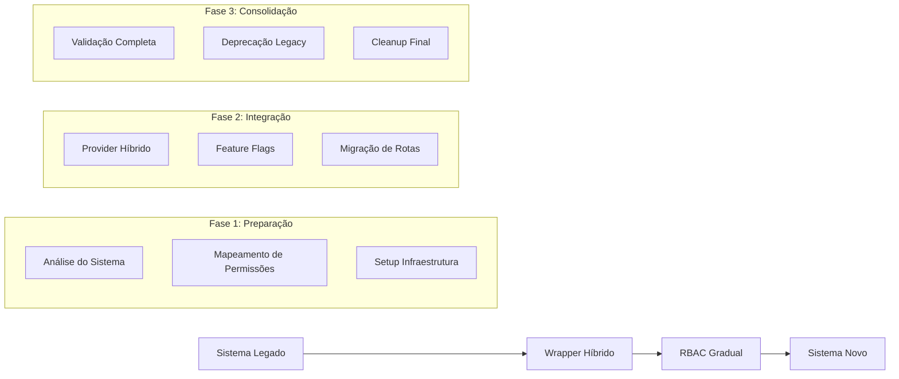
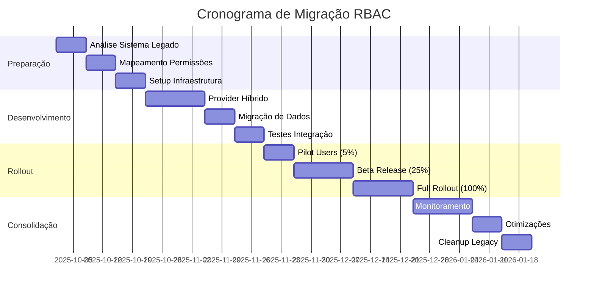

# 🔄 Guia de Migração RBAC ANPD

[]()
[]()
[]()

## 📋 Índice de Migração

- [🎯 Estratégias de Migração](#-estratégias-de-migração)
- [🔄 Migração Gradual](#-migração-gradual)
- [🏗️ Migração de Sistema Legado](#️-migração-de-sistema-legado)
- [💾 Migração de Dados](#-migração-de-dados)
- [⚛️ Migração React](#️-migração-react)
- [🌐 Migração Next.js](#-migração-nextjs)
- [✅ Validação e Testes](#-validação-e-testes)
- [🚨 Rollback e Contingência](#-rollback-e-contingência)

---

## 🎯 Estratégias de Migração

### Estratégia Recomendada: **Migração Gradual Híbrida**



### Tipos de Migração Suportados

#### 1. **Big Bang** (Não Recomendado)

- ❌ **Risco Alto**: Mudança total de uma vez
- ❌ **Rollback Difícil**: Difícil de reverter
- ✅ **Velocidade**: Migração rápida
- 🎯 **Uso**: Apenas para sistemas muito simples

#### 2. **Strangler Fig** (Recomendado)

- ✅ **Risco Baixo**: Substituição gradual
- ✅ **Rollback Fácil**: Cada feature pode ser revertida
- ✅ **Validação**: Teste contínuo durante migração
- 🎯 **Uso**: Sistemas complexos em produção

#### 3. **Feature Flags** (Híbrido)

- ✅ **Controle Granular**: Por usuário/feature
- ✅ **A/B Testing**: Comparação lado a lado
- ✅ **Rollback Instantâneo**: Flip de flag
- 🎯 **Uso**: Sistemas críticos

---

## 🔄 Migração Gradual

### Fase 1: Preparação e Análise

#### 1.1 Auditoria do Sistema Atual

```typescript
// scripts/audit-current-permissions.ts
import { existingAuthSystem } from "@/lib/legacy-auth"

interface LegacyPermissionAudit {
  roles: string[]
  permissions: string[]
  users: { id: string; roles: string[] }[]
  inconsistencies: string[]
}

async function auditCurrentSystem(): Promise<LegacyPermissionAudit> {
  const roles = await existingAuthSystem.getAllRoles()
  const permissions = await existingAuthSystem.getAllPermissions()
  const users = await existingAuthSystem.getAllUsersWithRoles()

  // Detectar inconsistências
  const inconsistencies: string[] = []

  // Verificar papéis órfãos
  for (const user of users) {
    for (const role of user.roles) {
      if (!roles.includes(role)) {
        inconsistencies.push(`User ${user.id} has invalid role: ${role}`)
      }
    }
  }

  return { roles, permissions, users, inconsistencies }
}

// Execução
const audit = await auditCurrentSystem()
console.log("Legacy System Audit:", audit)
```

#### 1.2 Mapeamento de Permissões

```typescript
// config/permission-mapping.ts
import type { Permissao } from "@anpdgovbr/rbac-core"

export const legacyToRbacMapping: Record<string, Permissao[]> = {
  // Papéis legados -> Permissões RBAC
  ADMIN: [
    { acao: "Administrar", recurso: "Sistema" },
    { acao: "Gerenciar", recurso: "Usuarios" },
    { acao: "Exibir", recurso: "Dashboard" },
  ],

  MANAGER: [
    { acao: "Gerenciar", recurso: "Usuarios" },
    { acao: "Exibir", recurso: "Relatorios" },
    { acao: "Criar", recurso: "Processo" },
  ],

  USER: [
    { acao: "Exibir", recurso: "Dashboard" },
    { acao: "Criar", recurso: "Solicitacao" },
  ],

  // Permissões específicas legadas
  CAN_EDIT_USERS: [{ acao: "Editar", recurso: "Usuario" }],

  CAN_VIEW_REPORTS: [{ acao: "Exibir", recurso: "Relatorios" }],
}

export const actionMapping: Record<string, string> = {
  CREATE: "Criar",
  READ: "Exibir",
  UPDATE: "Editar",
  DELETE: "Excluir",
  MANAGE: "Gerenciar",
  ADMIN: "Administrar",
}

export const resourceMapping: Record<string, string> = {
  USERS: "Usuarios",
  REPORTS: "Relatorios",
  PROCESSES: "Processos",
  DASHBOARD: "Dashboard",
  SYSTEM: "Sistema",
}
```

### Fase 2: Implementação Híbrida

#### 2.1 Provider Híbrido

```typescript
// lib/hybrid-permissions-provider.ts
import type { PermissionsProvider, PermissionsMap } from "@anpdgovbr/rbac-core"
import { toPermissionsMap } from "@anpdgovbr/rbac-core"
import { legacyToRbacMapping } from "@/config/permission-mapping"

interface MigrationConfig {
  enabledUsers: string[]
  enabledFeatures: string[]
  rolloutPercentage: number
}

export class HybridPermissionsProvider implements PermissionsProvider {
  constructor(
    private legacyAuthSystem: any,
    private newRbacProvider: PermissionsProvider,
    private migrationConfig: MigrationConfig
  ) {}

  async getUserPermissions(identity: string): Promise<PermissionsMap> {
    // Feature flag: verificar se usuário deve usar novo sistema
    const shouldUseNewSystem = await this.shouldUseNewSystem(identity)

    if (shouldUseNewSystem) {
      try {
        // Tentar sistema novo primeiro
        return await this.newRbacProvider.getUserPermissions(identity)
      } catch (error) {
        console.warn(`RBAC system failed for ${identity}, falling back to legacy`)
        // Fallback para sistema legado
        return await this.getLegacyPermissions(identity)
      }
    }

    // Usar sistema legado
    return await this.getLegacyPermissions(identity)
  }

  private async shouldUseNewSystem(identity: string): Promise<boolean> {
    // Verificação por usuário específico
    if (this.migrationConfig.enabledUsers.includes(identity)) {
      return true
    }

    // Verificação por percentual
    const hash = this.hashString(identity)
    const userPercentile = hash % 100

    return userPercentile < this.migrationConfig.rolloutPercentage
  }

  private async getLegacyPermissions(identity: string): Promise<PermissionsMap> {
    try {
      const legacyRoles = await this.legacyAuthSystem.getUserRoles(identity)
      const legacyPermissions = await this.legacyAuthSystem.getUserPermissions(identity)

      // Mapear para formato RBAC
      const rbacPermissions: Permissao[] = []

      // Mapear papéis
      for (const role of legacyRoles) {
        const mappedPermissions = legacyToRbacMapping[role] || []
        rbacPermissions.push(...mappedPermissions)
      }

      // Mapear permissões específicas
      for (const permission of legacyPermissions) {
        const mappedPermissions = legacyToRbacMapping[permission] || []
        rbacPermissions.push(...mappedPermissions)
      }

      return toPermissionsMap(rbacPermissions.map((p) => ({ ...p, grant: true })))
    } catch (error) {
      console.error(`Failed to get legacy permissions for ${identity}:`, error)
      return {} // Permissões vazias em caso de erro
    }
  }

  private hashString(str: string): number {
    let hash = 0
    for (let i = 0; i < str.length; i++) {
      const char = str.charCodeAt(i)
      hash = (hash << 5) - hash + char
      hash = hash & hash // Convert to 32-bit integer
    }
    return Math.abs(hash)
  }
}
```

#### 2.2 Configuração de Feature Flags

```typescript
// lib/migration-flags.ts
interface FeatureFlags {
  rbacEnabled: boolean
  rbacUsers: string[]
  rbacFeatures: string[]
  rolloutPercentage: number
  debugMode: boolean
}

export class MigrationFeatureFlags {
  private flags: FeatureFlags

  constructor() {
    this.flags = this.loadFlags()
  }

  private loadFlags(): FeatureFlags {
    return {
      rbacEnabled: process.env.RBAC_ENABLED === "true",
      rbacUsers: (process.env.RBAC_ENABLED_USERS || "").split(",").filter(Boolean),
      rbacFeatures: (process.env.RBAC_ENABLED_FEATURES || "").split(",").filter(Boolean),
      rolloutPercentage: parseInt(process.env.RBAC_ROLLOUT_PERCENTAGE || "0"),
      debugMode: process.env.RBAC_DEBUG === "true",
    }
  }

  shouldUseRbac(identity: string, feature?: string): boolean {
    if (!this.flags.rbacEnabled) return false

    // Feature específica habilitada?
    if (feature && !this.flags.rbacFeatures.includes(feature)) return false

    // Usuário específico habilitado?
    if (this.flags.rbacUsers.includes(identity)) return true

    // Percentual de rollout
    const hash = this.hashIdentity(identity)
    return hash % 100 < this.flags.rolloutPercentage
  }

  private hashIdentity(identity: string): number {
    // Implementação de hash consistente
    let hash = 0
    for (let i = 0; i < identity.length; i++) {
      hash = (hash << 5) - hash + identity.charCodeAt(i)
      hash = hash & hash
    }
    return Math.abs(hash)
  }

  getFlags(): FeatureFlags {
    return { ...this.flags }
  }

  updateFlags(newFlags: Partial<FeatureFlags>): void {
    this.flags = { ...this.flags, ...newFlags }
  }
}

export const migrationFlags = new MigrationFeatureFlags()
```

### Fase 3: Migração por Rotas

#### 3.1 Middleware de Migração

```typescript
// middleware/rbac-migration.ts
import { NextRequest, NextResponse } from "next/server"
import { migrationFlags } from "@/lib/migration-flags"

export async function rbacMigrationMiddleware(request: NextRequest) {
  const identity = await getIdentityFromRequest(request)
  if (!identity) return NextResponse.next()

  const pathname = request.nextUrl.pathname

  // Definir features por rota
  const featureMap: Record<string, string> = {
    "/admin": "admin-panel",
    "/users": "user-management",
    "/reports": "reports",
    "/api/users": "user-api",
    "/api/reports": "reports-api",
  }

  const feature = featureMap[pathname]
  const shouldUseRbac = migrationFlags.shouldUseRbac(identity, feature)

  // Adicionar header para indicar qual sistema usar
  const headers = new Headers(request.headers)
  headers.set("x-rbac-enabled", shouldUseRbac.toString())
  headers.set("x-rbac-feature", feature || "default")

  return NextResponse.next({
    request: {
      headers,
    },
  })
}
```

#### 3.2 API Routes Híbridas

```typescript
// app/api/users/route.ts
import { NextRequest } from "next/server"
import { withApi } from "@anpdgovbr/rbac-next"
import { hybridProvider } from "@/lib/hybrid-provider"

// Versão RBAC da rota
const rbacHandler = withApi(
  async (context) => {
    const users = await getUsersWithRbac(context.userId)
    return NextResponse.json(users)
  },
  {
    provider: hybridProvider,
    getIdentity: nextAuthResolver,
    permissao: { acao: "Exibir", recurso: "Usuarios" },
  }
)

// Versão legada da rota
async function legacyHandler(request: NextRequest) {
  const identity = await getIdentityFromRequest(request)
  const hasPermission = await legacyAuthSystem.checkPermission(identity, "CAN_VIEW_USERS")

  if (!hasPermission) {
    return NextResponse.json({ error: "Forbidden" }, { status: 403 })
  }

  const users = await getUsersWithLegacy(identity)
  return NextResponse.json(users)
}

// Router híbrido
export async function GET(request: NextRequest) {
  const useRbac = request.headers.get("x-rbac-enabled") === "true"

  if (useRbac) {
    return rbacHandler(request)
  } else {
    return legacyHandler(request)
  }
}
```

---

## 🏗️ Migração de Sistema Legado

### Análise de Sistemas Comuns

#### Sistema Baseado em Roles Simples

```typescript
// migration/simple-role-migration.ts
export class SimpleRoleMigration {
  async migrateFromSimpleRoles(legacyRoles: Record<string, string[]>): Promise<void> {
    for (const [userId, roles] of Object.entries(legacyRoles)) {
      // Mapear roles simples para perfis RBAC
      const rbacProfiles = roles.map((role) => this.mapLegacyRole(role))

      await this.createUserWithProfiles(userId, rbacProfiles)
    }
  }

  private mapLegacyRole(legacyRole: string): string {
    const roleMapping: Record<string, string> = {
      admin: "Administrador",
      user: "Usuario",
      manager: "Gerente",
      viewer: "Visualizador",
    }

    return roleMapping[legacyRole.toLowerCase()] || "Usuario"
  }
}
```

#### Sistema ACL (Access Control List)

```typescript
// migration/acl-migration.ts
export class ACLMigration {
  async migrateFromACL(
    aclData: Array<{
      userId: string
      resource: string
      actions: string[]
    }>
  ): Promise<void> {
    // Agrupar por usuário
    const userPermissions = new Map<string, Permissao[]>()

    for (const acl of aclData) {
      const permissions = acl.actions.map((action) => ({
        acao: this.mapAction(action),
        recurso: this.mapResource(acl.resource),
      }))

      const existing = userPermissions.get(acl.userId) || []
      userPermissions.set(acl.userId, [...existing, ...permissions])
    }

    // Criar perfis customizados para cada usuário ou encontrar perfis existentes
    for (const [userId, permissions] of userPermissions.entries()) {
      await this.createOrAssignProfile(userId, permissions)
    }
  }

  private mapAction(action: string): string {
    const actionMap: Record<string, string> = {
      create: "Criar",
      read: "Exibir",
      update: "Editar",
      delete: "Excluir",
      manage: "Gerenciar",
    }

    return actionMap[action.toLowerCase()] || action
  }
}
```

#### Sistema Claims/JWT

```typescript
// migration/claims-migration.ts
export class ClaimsMigration {
  async migrateFromClaims(
    userClaims: Array<{
      userId: string
      claims: Record<string, any>
    }>
  ): Promise<void> {
    for (const user of userClaims) {
      const permissions = this.extractPermissionsFromClaims(user.claims)
      await this.assignPermissionsToUser(user.userId, permissions)
    }
  }

  private extractPermissionsFromClaims(claims: Record<string, any>): Permissao[] {
    const permissions: Permissao[] = []

    // Processar claims específicos
    if (claims.role === "admin") {
      permissions.push({ acao: "Administrar", recurso: "Sistema" })
    }

    if (claims.permissions) {
      for (const perm of claims.permissions) {
        const [action, resource] = perm.split(":")
        permissions.push({
          acao: this.mapAction(action),
          recurso: this.mapResource(resource),
        })
      }
    }

    // Processar department-based permissions
    if (claims.department) {
      const deptPermissions = this.getDepartmentPermissions(claims.department)
      permissions.push(...deptPermissions)
    }

    return permissions
  }
}
```

---

## 💾 Migração de Dados

### Script de Migração de Schema

```sql
-- migration/001_create_rbac_schema.sql

-- Criar tabelas RBAC se não existirem
CREATE TABLE IF NOT EXISTS usuarios (
  id VARCHAR(255) PRIMARY KEY,
  email VARCHAR(255) UNIQUE NOT NULL,
  nome VARCHAR(255) NOT NULL,
  ativo BOOLEAN DEFAULT TRUE,
  created_at TIMESTAMP DEFAULT CURRENT_TIMESTAMP,
  updated_at TIMESTAMP DEFAULT CURRENT_TIMESTAMP ON UPDATE CURRENT_TIMESTAMP
);

CREATE TABLE IF NOT EXISTS perfis (
  id VARCHAR(255) PRIMARY KEY,
  nome VARCHAR(255) UNIQUE NOT NULL,
  descricao TEXT,
  ativo BOOLEAN DEFAULT TRUE,
  perfil_pai_id VARCHAR(255),
  created_at TIMESTAMP DEFAULT CURRENT_TIMESTAMP,
  updated_at TIMESTAMP DEFAULT CURRENT_TIMESTAMP ON UPDATE CURRENT_TIMESTAMP,
  FOREIGN KEY (perfil_pai_id) REFERENCES perfis(id) ON DELETE SET NULL
);

CREATE TABLE IF NOT EXISTS permissoes (
  id VARCHAR(255) PRIMARY KEY,
  acao VARCHAR(255) NOT NULL,
  recurso VARCHAR(255) NOT NULL,
  UNIQUE KEY unique_acao_recurso (acao, recurso)
);

CREATE TABLE IF NOT EXISTS usuario_perfis (
  id VARCHAR(255) PRIMARY KEY,
  usuario_id VARCHAR(255) NOT NULL,
  perfil_id VARCHAR(255) NOT NULL,
  ativo BOOLEAN DEFAULT TRUE,
  created_at TIMESTAMP DEFAULT CURRENT_TIMESTAMP,
  FOREIGN KEY (usuario_id) REFERENCES usuarios(id) ON DELETE CASCADE,
  FOREIGN KEY (perfil_id) REFERENCES perfis(id) ON DELETE CASCADE,
  UNIQUE KEY unique_usuario_perfil (usuario_id, perfil_id)
);

CREATE TABLE IF NOT EXISTS perfil_permissoes (
  id VARCHAR(255) PRIMARY KEY,
  perfil_id VARCHAR(255) NOT NULL,
  permissao_id VARCHAR(255) NOT NULL,
  grant_permission BOOLEAN DEFAULT TRUE,
  created_at TIMESTAMP DEFAULT CURRENT_TIMESTAMP,
  FOREIGN KEY (perfil_id) REFERENCES perfis(id) ON DELETE CASCADE,
  FOREIGN KEY (permissao_id) REFERENCES permissoes(id) ON DELETE CASCADE,
  UNIQUE KEY unique_perfil_permissao (perfil_id, permissao_id)
);

-- Índices para performance
CREATE INDEX idx_usuarios_email ON usuarios(email);
CREATE INDEX idx_usuarios_ativo ON usuarios(ativo);
CREATE INDEX idx_perfis_ativo ON perfis(ativo);
CREATE INDEX idx_usuario_perfis_usuario ON usuario_perfis(usuario_id);
CREATE INDEX idx_usuario_perfis_perfil ON usuario_perfis(perfil_id);
CREATE INDEX idx_perfil_permissoes_perfil ON perfil_permissoes(perfil_id);
```

### Scripts de Migração de Dados

```typescript
// scripts/migrate-users.ts
import { PrismaClient } from "@prisma/client"
import { v4 as uuidv4 } from "uuid"

const prisma = new PrismaClient()

interface LegacyUser {
  id: string
  email: string
  name: string
  active: boolean
  roles: string[]
}

export async function migrateUsers(legacyUsers: LegacyUser[]) {
  console.log(`Migrating ${legacyUsers.length} users...`)

  for (const legacyUser of legacyUsers) {
    try {
      // Criar ou atualizar usuário
      const user = await prisma.usuario.upsert({
        where: { email: legacyUser.email },
        update: {
          nome: legacyUser.name,
          ativo: legacyUser.active,
        },
        create: {
          id: uuidv4(),
          email: legacyUser.email,
          nome: legacyUser.name,
          ativo: legacyUser.active,
        },
      })

      // Mapear e atribuir perfis
      for (const roleName of legacyUser.roles) {
        const mappedProfileName = mapLegacyRoleToProfile(roleName)

        // Encontrar ou criar perfil
        const profile = await prisma.perfil.upsert({
          where: { nome: mappedProfileName },
          update: {},
          create: {
            id: uuidv4(),
            nome: mappedProfileName,
            descricao: `Migrado de: ${roleName}`,
          },
        })

        // Atribuir perfil ao usuário
        await prisma.usuarioPerfil.upsert({
          where: {
            usuarioId_perfilId: {
              usuarioId: user.id,
              perfilId: profile.id,
            },
          },
          update: {},
          create: {
            id: uuidv4(),
            usuarioId: user.id,
            perfilId: profile.id,
            ativo: true,
          },
        })
      }

      console.log(`✅ Migrated user: ${legacyUser.email}`)
    } catch (error) {
      console.error(`❌ Failed to migrate user ${legacyUser.email}:`, error)
    }
  }

  console.log("User migration completed!")
}

function mapLegacyRoleToProfile(legacyRole: string): string {
  const mapping: Record<string, string> = {
    admin: "Administrador",
    manager: "Gerente",
    user: "Usuario",
    guest: "Convidado",
  }

  return mapping[legacyRole.toLowerCase()] || "Usuario"
}
```

### Validação de Migração

```typescript
// scripts/validate-migration.ts
export async function validateMigration() {
  const validationResults = {
    usersCount: 0,
    profilesCount: 0,
    permissionsCount: 0,
    inconsistencies: [] as string[],
  }

  // Contagem básica
  validationResults.usersCount = await prisma.usuario.count()
  validationResults.profilesCount = await prisma.perfil.count()
  validationResults.permissionsCount = await prisma.permissao.count()

  // Validar integridade referencial
  const orphanedUserProfiles = await prisma.usuarioPerfil.findMany({
    where: {
      OR: [{ usuario: null }, { perfil: null }],
    },
  })

  if (orphanedUserProfiles.length > 0) {
    validationResults.inconsistencies.push(
      `Found ${orphanedUserProfiles.length} orphaned user-profile associations`
    )
  }

  // Validar hierarquia de perfis
  const circularHierarchy = await checkCircularHierarchy()
  if (circularHierarchy.length > 0) {
    validationResults.inconsistencies.push(
      `Found circular hierarchy in profiles: ${circularHierarchy.join(", ")}`
    )
  }

  return validationResults
}

async function checkCircularHierarchy(): Promise<string[]> {
  const profiles = await prisma.perfil.findMany({
    select: { id: true, nome: true, perfilPaiId: true },
  })

  const circularProfiles: string[] = []

  for (const profile of profiles) {
    if (await hasCircularReference(profile.id, profiles)) {
      circularProfiles.push(profile.nome)
    }
  }

  return circularProfiles
}
```

---

## ⚛️ Migração React

### Migração de Componentes

```typescript
// components/migration/legacy-wrapper.tsx
import { usePode } from '@anpdgovbr/rbac-react'
import { migrationFlags } from '@/lib/migration-flags'
import { useUser } from '@/hooks/use-user'

interface LegacyWrapperProps {
  children: React.ReactNode
  legacyPermission?: string
  rbacAction?: string
  rbacResource?: string
  feature?: string
}

export function LegacyWrapper({
  children,
  legacyPermission,
  rbacAction,
  rbacResource,
  feature
}: LegacyWrapperProps) {
  const { user } = useUser()
  const { pode } = usePode()

  if (!user) return null

  const shouldUseRbac = migrationFlags.shouldUseRbac(user.email, feature)

  let hasPermission = false

  if (shouldUseRbac && rbacAction && rbacResource) {
    // Usar sistema RBAC
    hasPermission = pode(rbacAction, rbacResource)
  } else if (legacyPermission) {
    // Usar sistema legado
    hasPermission = user.legacyPermissions?.includes(legacyPermission) || false
  }

  return hasPermission ? <>{children}</> : null
}

// Uso
<LegacyWrapper
  legacyPermission="CAN_EDIT_USERS"
  rbacAction="Editar"
  rbacResource="Usuario"
  feature="user-management"
>
  <EditUserButton />
</LegacyWrapper>
```

### Hook de Migração

```typescript
// hooks/use-permission-migration.ts
import { usePode } from '@anpdgovbr/rbac-react'
import { useUser } from '@/hooks/use-user'
import { migrationFlags } from '@/lib/migration-flags'

interface UsePermissionMigrationOptions {
  feature?: string
  legacyPermission?: string
  rbacAction?: string
  rbacResource?: string
}

export function usePermissionMigration({
  feature,
  legacyPermission,
  rbacAction,
  rbacResource
}: UsePermissionMigrationOptions) {
  const { user } = useUser()
  const { pode, loading: rbacLoading } = usePode()

  const shouldUseRbac = user ? migrationFlags.shouldUseRbac(user.email, feature) : false

  let hasPermission = false
  let loading = false

  if (shouldUseRbac && rbacAction && rbacResource) {
    hasPermission = pode(rbacAction, rbacResource)
    loading = rbacLoading
  } else if (legacyPermission && user) {
    hasPermission = user.legacyPermissions?.includes(legacyPermission) || false
    loading = false
  }

  return {
    hasPermission,
    loading,
    usingRbac: shouldUseRbac,
    system: shouldUseRbac ? 'rbac' : 'legacy'
  }
}

// Uso
function EditUserButton() {
  const { hasPermission, loading, usingRbac } = usePermissionMigration({
    feature: 'user-management',
    legacyPermission: 'CAN_EDIT_USERS',
    rbacAction: 'Editar',
    rbacResource: 'Usuario'
  })

  if (loading) return <ButtonSkeleton />

  return (
    <Button
      disabled={!hasPermission}
      title={usingRbac ? 'RBAC System' : 'Legacy System'}
    >
      Editar Usuário
    </Button>
  )
}
```

---

## 🌐 Migração Next.js

### API Routes Graduais

```typescript
// lib/api-migration.ts
import { NextRequest, NextResponse } from "next/server"
import { withApi } from "@anpdgovbr/rbac-next"

export function createMigrationRoute<T = any>(
  legacyHandler: (req: NextRequest) => Promise<NextResponse<T>>,
  rbacConfig: {
    handler: (context: any) => Promise<NextResponse<T>>
    provider: any
    getIdentity: any
    permissao: { acao: string; recurso: string }
  }
) {
  const rbacHandler = withApi(rbacConfig.handler, {
    provider: rbacConfig.provider,
    getIdentity: rbacConfig.getIdentity,
    permissao: rbacConfig.permissao,
  })

  return async function (request: NextRequest) {
    const useRbac = request.headers.get("x-rbac-enabled") === "true"

    if (useRbac) {
      try {
        return await rbacHandler(request)
      } catch (error) {
        console.error("RBAC handler failed, falling back to legacy:", error)
        return await legacyHandler(request)
      }
    }

    return await legacyHandler(request)
  }
}

// Uso
export const GET = createMigrationRoute(
  // Legacy handler
  async (request) => {
    const identity = await getLegacyIdentity(request)
    if (!(await legacyAuth.checkPermission(identity, "VIEW_USERS"))) {
      return NextResponse.json({ error: "Forbidden" }, { status: 403 })
    }

    const users = await getLegacyUsers()
    return NextResponse.json(users)
  },

  // RBAC config
  {
    handler: async (context) => {
      const users = await getUsers()
      return NextResponse.json(users)
    },
    provider: hybridProvider,
    getIdentity: nextAuthResolver,
    permissao: { acao: "Exibir", recurso: "Usuarios" },
  }
)
```

---

## ✅ Validação e Testes

### Testes de Migração

```typescript
// __tests__/migration.test.ts
import { migrateUsers } from "@/scripts/migrate-users"
import { validateMigration } from "@/scripts/validate-migration"

describe("Migration Tests", () => {
  beforeEach(async () => {
    // Setup test database
    await setupTestDb()
  })

  afterEach(async () => {
    // Cleanup
    await cleanupTestDb()
  })

  it("should migrate users correctly", async () => {
    const legacyUsers = [
      {
        id: "1",
        email: "admin@test.com",
        name: "Admin User",
        active: true,
        roles: ["admin", "user"],
      },
      {
        id: "2",
        email: "user@test.com",
        name: "Regular User",
        active: true,
        roles: ["user"],
      },
    ]

    await migrateUsers(legacyUsers)

    const validation = await validateMigration()
    expect(validation.usersCount).toBe(2)
    expect(validation.inconsistencies).toHaveLength(0)
  })

  it("should handle permission mapping correctly", async () => {
    const legacyUser = {
      id: "1",
      email: "test@test.com",
      name: "Test User",
      active: true,
      roles: ["admin"],
    }

    await migrateUsers([legacyUser])

    // Verificar se as permissões foram mapeadas corretamente
    const permissions = await hybridProvider.getUserPermissions("test@test.com")
    expect(permissions["Administrar:Sistema"]).toBe(true)
  })
})
```

### Testes A/B

```typescript
// lib/ab-testing.ts
export class RBACAbTesting {
  private metrics = new Map<string, number>()

  async comparePerformance(identity: string, action: string, resource: string) {
    const startTime = Date.now()

    // Testar sistema legado
    const legacyStart = Date.now()
    const legacyResult = await this.testLegacyPermission(identity, action, resource)
    const legacyDuration = Date.now() - legacyStart

    // Testar sistema RBAC
    const rbacStart = Date.now()
    const rbacResult = await this.testRbacPermission(identity, action, resource)
    const rbacDuration = Date.now() - rbacStart

    // Registrar métricas
    this.metrics.set(`legacy.${action}.${resource}`, legacyDuration)
    this.metrics.set(`rbac.${action}.${resource}`, rbacDuration)

    // Verificar consistência
    if (legacyResult !== rbacResult) {
      console.warn(
        `Inconsistent results for ${identity}: legacy=${legacyResult}, rbac=${rbacResult}`
      )
    }

    return {
      legacy: { result: legacyResult, duration: legacyDuration },
      rbac: { result: rbacResult, duration: rbacDuration },
      consistent: legacyResult === rbacResult,
    }
  }

  getPerformanceReport() {
    const report = {
      legacy: { avg: 0, count: 0 },
      rbac: { avg: 0, count: 0 },
    }

    // Calcular médias
    for (const [key, duration] of this.metrics.entries()) {
      if (key.startsWith("legacy.")) {
        report.legacy.avg += duration
        report.legacy.count++
      } else if (key.startsWith("rbac.")) {
        report.rbac.avg += duration
        report.rbac.count++
      }
    }

    if (report.legacy.count > 0) {
      report.legacy.avg /= report.legacy.count
    }

    if (report.rbac.count > 0) {
      report.rbac.avg /= report.rbac.count
    }

    return report
  }
}
```

---

## 🚨 Rollback e Contingência

### Estratégia de Rollback

```typescript
// lib/rollback-strategy.ts
export class RollbackStrategy {
  async executeRollback(rollbackLevel: "user" | "feature" | "global") {
    switch (rollbackLevel) {
      case "user":
        await this.rollbackUser()
        break
      case "feature":
        await this.rollbackFeature()
        break
      case "global":
        await this.rollbackGlobal()
        break
    }
  }

  private async rollbackUser(userId?: string) {
    if (userId) {
      // Rollback usuário específico
      migrationFlags.updateFlags({
        rbacUsers: migrationFlags.getFlags().rbacUsers.filter((u) => u !== userId),
      })
    } else {
      // Rollback todos os usuários específicos
      migrationFlags.updateFlags({ rbacUsers: [] })
    }
  }

  private async rollbackFeature(feature?: string) {
    if (feature) {
      // Rollback feature específica
      const flags = migrationFlags.getFlags()
      migrationFlags.updateFlags({
        rbacFeatures: flags.rbacFeatures.filter((f) => f !== feature),
      })
    } else {
      // Rollback todas as features
      migrationFlags.updateFlags({ rbacFeatures: [] })
    }
  }

  private async rollbackGlobal() {
    // Rollback completo - voltar ao sistema legado
    migrationFlags.updateFlags({
      rbacEnabled: false,
      rbacUsers: [],
      rbacFeatures: [],
      rolloutPercentage: 0,
    })
  }
}

// Comando de emergência
export async function emergencyRollback() {
  console.log("🚨 Executing emergency rollback...")

  const rollback = new RollbackStrategy()
  await rollback.executeRollback("global")

  console.log("✅ Emergency rollback completed")
}
```

### Monitoramento de Saúde

```typescript
// lib/migration-health.ts
export class MigrationHealthMonitor {
  private errors = new Map<string, number>()
  private successRate = new Map<string, { success: number; total: number }>()

  reportError(system: "legacy" | "rbac", error: Error, context: string) {
    const key = `${system}.${context}`
    this.errors.set(key, (this.errors.get(key) || 0) + 1)

    // Auto-rollback se muitos erros
    if (this.errors.get(key)! > 10) {
      console.error(`Too many errors in ${system} system, triggering rollback`)
      this.triggerAutoRollback(system, context)
    }
  }

  reportSuccess(system: "legacy" | "rbac", context: string) {
    const key = `${system}.${context}`
    const current = this.successRate.get(key) || { success: 0, total: 0 }

    this.successRate.set(key, {
      success: current.success + 1,
      total: current.total + 1,
    })
  }

  getHealthStatus() {
    const health = {
      legacy: { errorRate: 0, successRate: 0 },
      rbac: { errorRate: 0, successRate: 0 },
    }

    // Calcular taxas de erro e sucesso
    for (const [key, errorCount] of this.errors.entries()) {
      const [system] = key.split(".")
      if (system === "legacy" || system === "rbac") {
        health[system].errorRate += errorCount
      }
    }

    for (const [key, rates] of this.successRate.entries()) {
      const [system] = key.split(".")
      if (system === "legacy" || system === "rbac") {
        health[system].successRate = rates.success / rates.total
      }
    }

    return health
  }

  private async triggerAutoRollback(system: string, context: string) {
    const rollback = new RollbackStrategy()

    if (system === "rbac") {
      // Se RBAC está falhando, fazer rollback para legacy
      await rollback.executeRollback("global")
    }
  }
}

export const migrationHealth = new MigrationHealthMonitor()
```

---

## 📊 Timeline de Migração Recomendado

### Cronograma Sugerido (3 meses)



### Critérios de Go/No-Go

**Go Criteria:**

- ✅ Taxa de sucesso > 99%
- ✅ Performance similar ou melhor
- ✅ Zero inconsistências críticas
- ✅ Rollback testado e funcional

**No-Go Criteria:**

- ❌ Taxa de erro > 1%
- ❌ Performance degradada > 50%
- ❌ Inconsistências de permissão
- ❌ Falhas no processo de rollback

---

**Status**: Guia Completo | **Última Atualização**: Setembro 2025  
**Mantido por**: Divisão de Desenvolvimento e Sustentação de Sistemas (DDSS/CGTI/ANPD)
